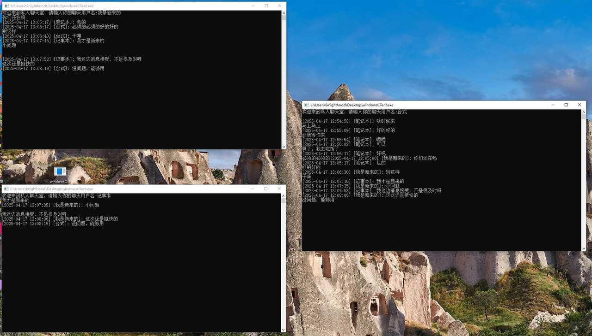
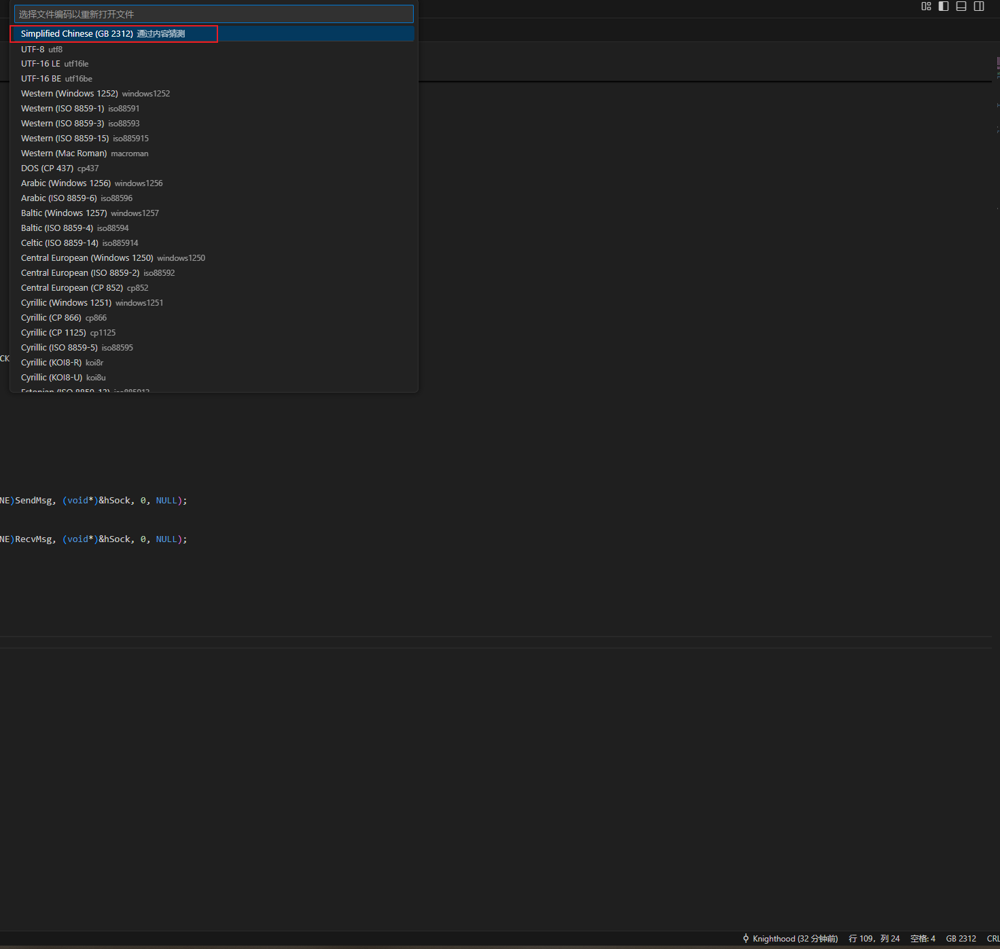

# 多人聊天室项目
- ChatServer是服务器端，如果你需要发送给别人就能使用，就需要购买云服务器。
- windowsClient是windows的客户端

# 如何使用
- 在服务器端，在`ChatServer\bin\x64\Debug\`输入
```shell
./ChatServer.out
```
- 在客户端，双击`windowsClient.exe`

这里我也使用了两台电脑进行测试。因为我感觉一台电脑上，会有点问题。但是我又测试了一下，可能是网速的问题。


代码中如果出现编码问题，请使用gb 2312编码方式查看。
